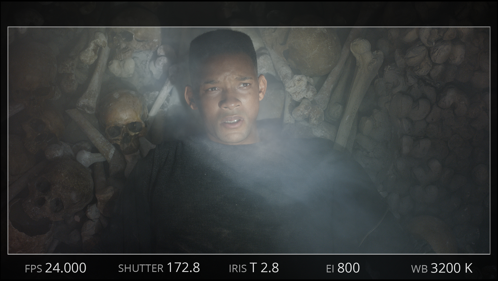
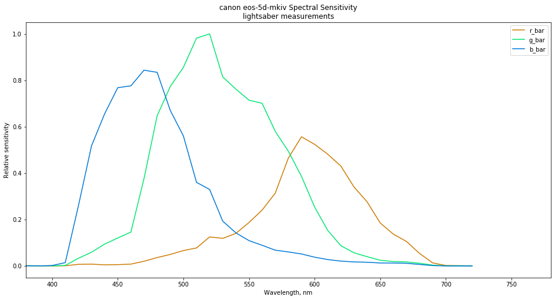
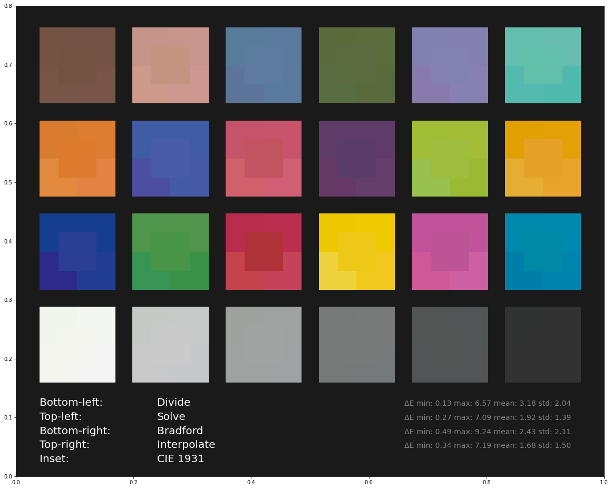

# PhysLight

This repository contains a collection of materials describing
PhysLight. *PhysLight* is a philosophy as much as a method. This means
that there is not one simple plugin to install to "get" *PhysLight*.
 
## Foundation

The documentation contained in `/docs` describes the conceptual background and
mathematical foundation which are the basis for *PhysLight*.
It also has fully worked out numerical examples of various common configurations
that people can use to double-check their work, together with indications and
reference code segments for all the algorithms and methods described.

We keep a PDF build of the docs right in the 
[docs directory](https://github.com/wetadigital/physlight/tree/main/docs)

Our latest full PDF build is 
[here](https://github.com/wetadigital/physlight/blob/main/docs/physLight-v1.3-1bdb6ec3-20230805.pdf)
corresponding to our in-progress v1.3 sprint on the documentation.

No changes are happening to the definitions, but all the document is being worked on
and edited for clarity in hopes to make it more useful for people.
Feedback is _very_ welcome

### Siggraph 2020 Talk
 
A higher level overview of the *PhysLight* system was presented in the
Siggraph 2020 Talk *PhysLight: An End-to-End Pipeline for
Scene-Referred Lighting*. [Slides can be found
here.](https://drive.google.com/file/d/1a2jGciAmfH9yPdJCXNuNNEs_U07znp9C/view?usp=sharing)

## USD Schema

In the usd folder are a set of schema that can be used to apply to
lights and cameras in USD to store and carry necessary information to
implement a system that communicates lights and camera data necessary
to implement a PhysLight compliant render chain.

## Practical Data

The `data` directory contains the spectral sensitivity curves of a number of cameras as measured with our 'lightsaber' system. It also contains [a notebook](https://github.com/wetadigital/physlight/blob/master/data/plot_curves.ipynb) that loads the data and plots the curves for visual inspection.

## Examples

The [imaging notebook](https://github.com/wetadigital/physlight/blob/master/examples/physlight_imaging.ipynb) shows a simple example of calculating the imaging ratio and checking that it gives the correct response for an idealized camera system.

The [physlight camera model notebook](https://github.com/wetadigital/physlight/blob/master/examples/physlight_camera_model.ipynb) shows how to use the curves to convert from spectral radiance to Camera RGB, solve matrices to go from Camera RGB to XYZ, and compares different approaches for handling white balance.

